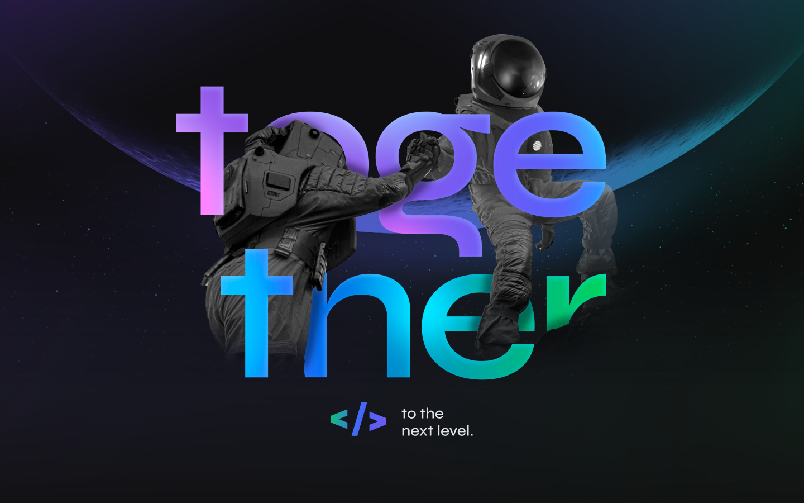
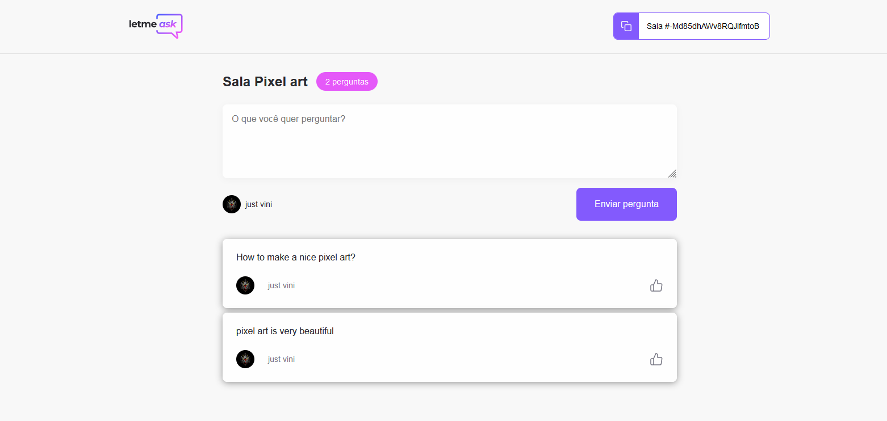

<div align="center">
    <h2>NLW-6-Together</h2>
</div>

---

<div>
    
</div>

---

<div align="center">

## Preview

</div>
<div>
    
</div>

<p align="center" target="_blank">
    Made with 💜 by Vinicius Jose
</p>

---

## 🔥 O Projeto

Esse projeto foi desenvolvido durante a trilha de React, na sexta edição da next-level-week vulgo **NLW/Together**, aprendemos conceitos sobre Typescript, React, Hooks e boas praticas com React. Todos os esses conceitos foram aplicando para desevolver esse projeto(Letmeask).
O letmeask e uma aplicação para melhorar a interetividade de um chat com muitas perguntas ou até para simplesmente melhorar a interação com o seu publico.

---

## 🚀 Tecnologias Utilizadas

- TypeScript
- React
- Firebase
- Node-sass

## Para Clonar o projeto

```bash
    $ git clone https://github.com/zV1N1/NLW-Together-React.git

    # Go into the repository
    $ cd letmeask

    # Install dependencies
    $ npm install

    # Run the app
    $ npm start
```

# 📝 Sobre

<h4 align="center"> As aulas foram ministradas pela [Diego Fernandes](https://github.com/diego3g) instrutor da [Rocketseat](https://rocketseat.com.br/)</h4>

---

<h4 align="center"> <em>&lt;/&gt;</em> by <a href="https://github.com/zV1N1" target="_blank">zV1N1</a> </h4>